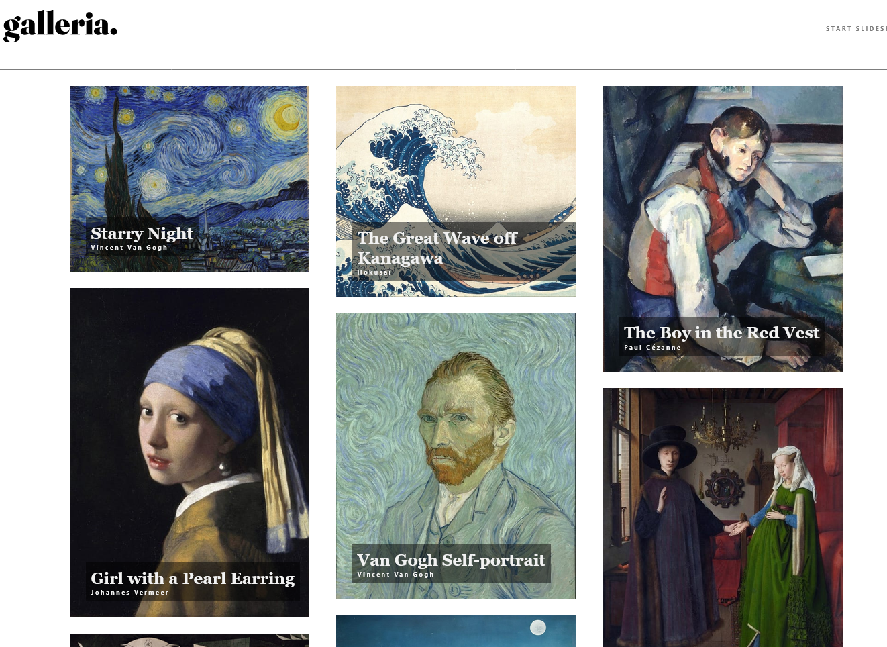

# Frontend Mentor - Galleria slideshow site solution

This is a solution to the [Galleria slideshow site challenge on Frontend Mentor](https://www.frontendmentor.io/challenges/galleria-slideshow-site-tEA4pwsa6). Frontend Mentor challenges help you improve your coding skills by building realistic projects.

## Table of contents

## Overview

### The challenge

Users should be able to:

- View the optimal layout for the app depending on their device's screen size
- See hover states for all interactive elements on the page
- Navigate the slideshow and view each painting in a lightbox

### Screenshot

- Solution URL: github.com/cgojk/gallery.
- Live Site URL: [Add live site URL here](https://your-live-site-url.com)

## My process

### Built with

- Semantic HTML5 markup
- CSS custom properties
- Flexbox
- CSS Grid
- Columns for the grids
  \_animation using motion hook from react
- Mobile-first workflow
- React: Router, Motion, UseState
- SCSS

### What I learned

Within this project, I have learned and applied a wide range of concepts, including React hooks, animations, layout techniques, component organisation, and routing.

One of the main challenges I faced was creating the gallery layout. Initially, I tried to achieve the design using traditional CSS Grid and Flexbox, but I struggled to create the desired masonry-style layout because the images had different proportions, with some paintings being taller and others wider. After researching different CSS layout techniques, I discovered the CSS Columns property, which was more suitable for this type of gallery. Using column-count, column-gap, and break-inside: avoid, I was able to create a layout where each item maintains its natural height instead of being restricted by grid row sizing.

I also worked with Framer Motion for animations. Although I had used animation libraries before, this project helped me understand how to apply motion components in React, control transitions, and create smoother user interactions; at least I tried; it is still not good the transition effect it jumps to the next part.

The project also reinforced my understanding of React Router, including dynamic routes, useParams, and navigation with useNavigate. I used route parameters to identify individual gallery items and mapped through the data array to display the correct content dynamically.

Another important area of learning was building the modal image viewer. I focused on creating reusable components and managing the modal state using React's useState hook. This helped me better understand how component communication and state management work in React applications.

Throughout the project, I also continued improving my understanding of CSS positioning, especially the use of position: relative, position: absolute, and position: fixed in different UI situations.

Although the project is not perfect, it provided many valuable learning opportunities. I gained more confidence working with React components, hooks, CSS layout techniques, and responsive design. I also recognise that writing cleaner and more consistent code is an area I want to continue improving, but with more practice I will develop better structure and efficiency in my development process.

#

## Author

Catalina G.
